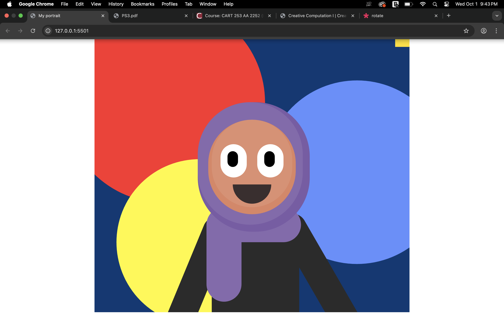

# Art Jam 

Shrook Ahmed

[View this project online](https://shrook12.github.io/cart253/topics/projects/art_jam_shrook_ahmed/)

## Description

This is a portrait of me. I used the colors I love throughout the project. I created a playful and colorful background with circles that grow over time, with specific areas. My love for playful and colorful art and designs is what inspired me. I also made the color of my hijab (head covering) change when the mouse overlaps, since I wear different colors of hijab, and to show the importance of the hijab to me by adding mouse interaction.

## Screenshot(s)

This bit should have some images of the program running so that the reader has a sense of what it looks like. For example:

> 

## Attribution

This bit should attribute any code, assets or other elements used taken from other sources. For example:

> - This project uses [p5.js](https://p5js.org).
> - This project uses the Overlapping Rectangles
by pippinbarr(https://editor.p5js.org/pippinbarr/sketches/5hnVN-_C0).

## License

This bit should include the license you want to apply to your work. For example:

> This project is licensed under a Creative Commons Attribution ([CC BY 4.0](https://creativecommons.org/licenses/by/4.0/deed.en)) license with the exception of libraries and other components with their own licenses.