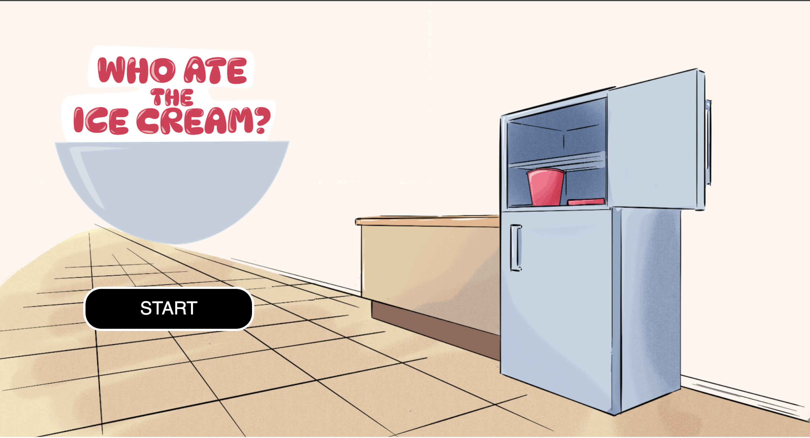
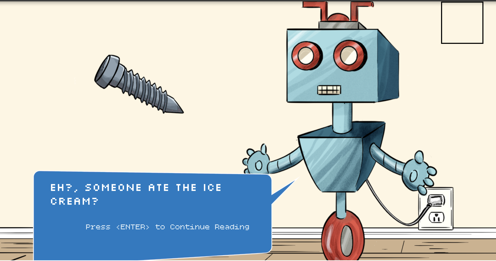
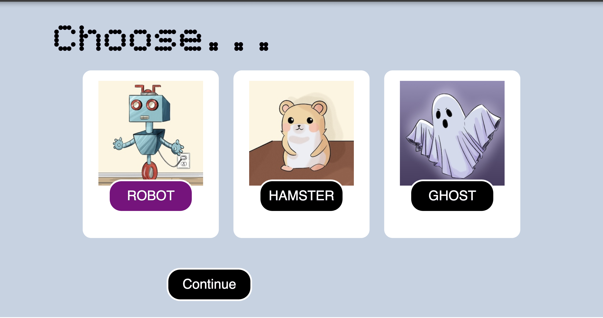

# WHO ATE THE ICE CREAM?

Shrook Ahmed

[View this project online](URL_FOR_THE_RUNNING_PROJECT)

## Description

Welcome to the: Who Ate the Ice Cream. This is a detective game. It doesn't really have any other goal than having fun discovering the culprits. You become a detective, and you have to discover who ate the ice cream, as the title says. The suspects are: The robot, the hamaster,and the ghost.

There are different interactions for this. Press the Enter key to read the next line, click the continue button to move to the next state, and explore for hidden clues with different interactive elements.

## Screenshot(s)

This bit should have some images of the program running so that the reader has a sense of what it looks like. For example:

> 
> 
> 

## Attribution

This bit should attribute any code, assets or other elements used taken from other sources. For example:

> - This project uses [p5.js](https://p5js.org).
> - This project uses code from pattvira - magnifying glass excercise change by glitchcowboi: https://editor.p5js.org/glitchcowboi/sketches/CTD_3KnCw
> - This project uses code from Scratch off by BarneyCodes: https://editor.p5js.org/glitchcowboi/sketches/CTD_3KnCw

## License

This bit should include the license you want to apply to your work. For example:

> This project is licensed under a Creative Commons Attribution ([CC BY 4.0](https://creativecommons.org/licenses/by/4.0/deed.en)) license with the exception of libraries and other components with their own licenses.

